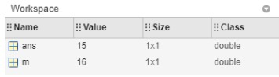
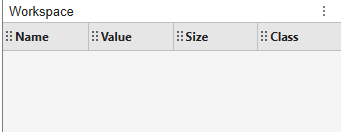

# MATLAB (MATrix LABoratory)
MATLAB é uma ferramenta e uma linguagem de programação de alto nível, e tem como principais funções: construção de gráficos e compilação de funções, manipulação de funções específicas de cálculo e variáveis simbólicas. 


### para multiplicar dois números : 
```bash
>> 3 * 5
```

```bash
(>>) representa o prompt onde estou digitando
```
### o resultado é armazenado na variável ans
```bash
>> 3 * 5

ans =

    15
```

```bash
(=)  é o operador de atribuição 
```

### posso armazenar o resultado em uma variável 
```bash
>>m = 3 * 5
```

```bash
>> m = 3 * 5

m = 

    15
```
### posso fazer operações com a minha variável 
```bash
>> m = m + 1

m = 

    16
```

### Workspace onde posso ver todas as variáveis criadas 



### Para apenas armazenar o valor da operação basta
```bash
>>x = 2 - 3
```

```bash
>>x = 2 - 3
>>x 
```## MATLAB (MATrix LABoratory)
### para multiplicar dois números : 
```bash
>> 3 * 5
```

```bash
(>>) representa o prompt onde estou digitando
```
### o resultado é armazenado na variável ans
```bash
>> 3 * 5

ans =

    15
```

```bash
(=)  é o operador de atribuição 
```

### posso armazenar o resultado em uma variável 
```bash
>>m = 3 * 5
```

```bash
>> m = 3 * 5

m = 

    15
```
### posso fazer operações com a minha variável 
```bash
>> m = m + 1

m = 

    16
```

### Workspace onde posso ver todas as variáveis criadas 


### Para apenas armazenar o valor da operação basta
```bash
>>x = 2 - 3
```

```bash
>>x = 2 - 3
>>x 
```
### Saída do programa
```bash
>>x = -1
[Execution complete with exit code 0]
```

### Salvar as variáveis carregadas no workspace
```bash
>>save filename
```

### para limpar o workspace 
```bash 
>>clear
```


### para carregar arquivo salvo anteriormente 
```bash
>>load nomedoArquivo
```

### posso ver o conteúdo da minha variável 
```bash
>>nomedavariavel
```

### para limpar tudo do workspace 
```bash
>>clc
```

### Matlab possui constantes internas 
## π 
### sua representação:

```bash
>>a = pi
a = 
    3.1416
```

### Matlab possui funções internas
```bash
>>a = sin(-5)
a = 
    0.9589
```

### No MATLAB, um único número, é chamado escalar, é representado por uma matriz 1 por 1, o que significa que a matriz contém uma linha e uma coluna.
```bash
x = 13;
```

## criando um array x com dois elementos 
```bash
y = [7 9]
```

### Ao usar espaços para separar números, o MATLAB combina os números em um vetor de linha, que é uma matriz com uma linha e várias colunas (1 por n). Ao usar ponto e vírgula para separar os números, o MATLAB cria um vetor de coluna (n por 1)

```bash
d = [1;3]
d = 
    1
    3
```

### podemos usar uma combinação de espaços e ponto e vírgula para criar uma matriz, que é um array com várias linhas e colunas. Ao criar uma matriz, você insere os elementos linha por linha.
```bash
l = [3 4 5; 6 7 8]
l = 
    3    4    5
    6    7    8
```

### Podemos realizar cálculos dentro dos colchetes.
```bash
x = [abs(-4) 4^2]
x = 
     4    16
```

### Para vetores longos, inserir número por número não   é prático. Um método alternativo é utilizar pontos (:) e especificar apenas os valores inicial e final.
```bash
y = 5:8
y =

    5 6 7 8
```

### operador (:) usa um espaçamento padrão de 1. No entanto, Podemos especificar um espaçamento diferente. Por exemplo, este comando especifica um espaçamento de 2:

```bash
d = 20:2:26
d = 
    20    22    24    26
```

### Se sabemos o número de elementos que desejamos em um vetor (em vez do espaçamento entre cada elemento), podemos usar a função linspace.
```bash
linspace(primeiroElemento,ultimoElemento,numerodeElementos)
```

```bash
z = linspace(0,1,5)
z = 
    0    0.250    0.500    0.750    1.000
```

### se precisarmos fazer a transposição um vetor de linha em um vetor de coluna o operador (') faz esta operação 
```bash
x = 1:3
x =
    1    2    3

x = x'
x = 
    1
    2
    3   
```

### podemos criar vetores de coluna em um único comando criando o vetor de linha e transpondo tudo em uma linha.
```bash
x = (1:2:5)'
x = 
    1
    3
    5 
```

### O MATLAB possui várias funções que criam matrizes comumente usadas, como matrizes de números aleatórios.
```bash
x = rand(2)
x = 
    0.8147    0.1270
    0.9058    0.9134
```

### Muitas funções de criação de matrizes nos permitem inserir um número para criar uma matriz quadrada (n por n) ou insirir dois números para criar uma matriz retangular (m por n).

```bash
x = rand(2)
x = 
    0.8147    0.1270
    0.9058    0.9134

x = rand(2,3)
x = 
    0.6324    0.2785    0.9575
    0.0975    0.5469    0.9649
```

### A maioria das funções de criação de array aceita as mesmas entradas que rand. Por exemplo, as funções zeros e ones criam matrizes de todos os zeros e todos os uns, respectivamente.

```bash
x = ones(2,3)
x = 
    1    1    1
    1    1    1
```

### Como você determina o tamanho de uma matriz existente? Você pode usar a função size.
```bash
size(x)
```
### Você também pode criar uma matriz com o mesmo tamanho de uma matriz existente em uma linha de código.
```bash
rand(size(x))
```

### Você pode extrair valores de uma matriz usando indexação de linha-coluna.
```bash
y = A(5,7)
```
### Esta sintaxe extrai o valor na 5ª linha e 7ª coluna de A e atribui o resultado à variável y


### podemos usar a palavra-chave end do MATLAB como um índice de linha ou coluna para referenciar o último elemento.
```bash 
y = A(end,2)
```

### Você pode usar aritmética com a palavra-chave end. 
#### Por exemplo:
```bash 
y = A(end-1,end-2)
```

### Se usarmos apenas um índice com uma matriz, o MATLAB percorre cada coluna em ordem. Por exemplo, este código retorna o valor 6.
```bash 
A = [5 6; 7 8]
A(3)
```
```bash
A =

   5   6
   7   8

ans = 6
```

#### Quando usamos como um índice, o operador dois pontos (:) especifica todos os elementos naquela dimensão. Por exemplo, o código a seguir cria um vetor de coluna contendo todos os elementos da primeira coluna de A.
```bash 
A = [3 1 4; 5 7 8]

x = A(:,1)
```
```bash
A =

   3   1   4
   5   7   8

x =
   3
   5
```

### podemos usar o operador dois pontos para especificar um intervalo de valores.  código a seguir cria uma matriz contendo a primeira, segunda e terceira linhas da matriz A.
```bash 
x = [1 2 3;5 6 7; 10 11 12; 15 17 18]

y= x(1:2,:)

```

```bash 
x =

    1    2    3
    5    6    7
   10   11   12
   15   17   18

y =

   1   2   3
   5   6   7
```

### se quisermos pegar as duas últimas colunas 
```bash 
x = [1 2 3;5 6 7; 10 11 12; 15 17 18]

y= x(:,2:3)

```

```bash 
x =

    1    2    3
    5    6    7
   10   11   12
   15   17   18

y =

    2    3
    6    7
   11   12
   17   18
```
